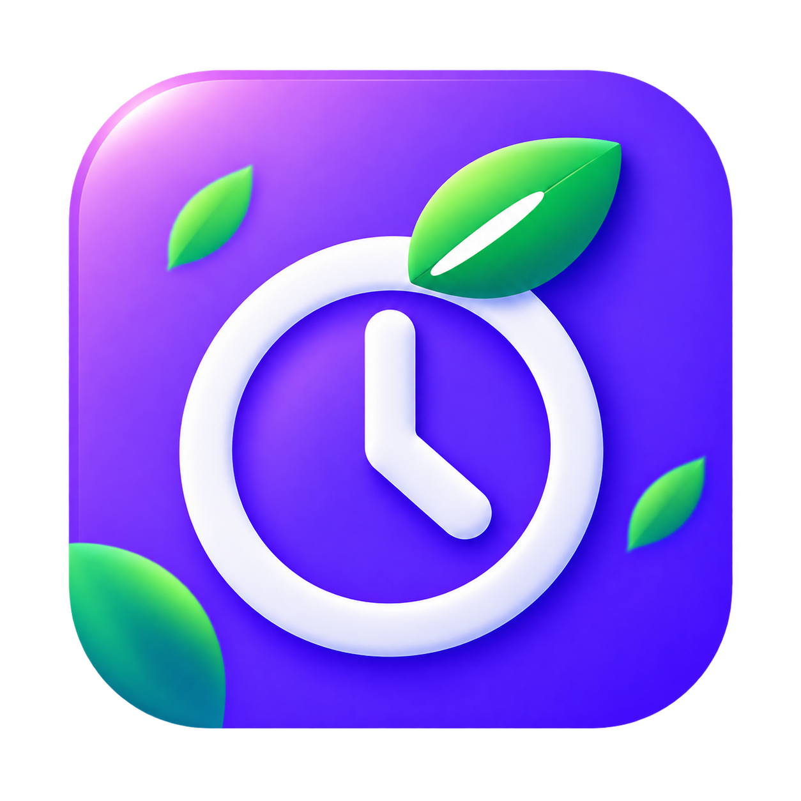
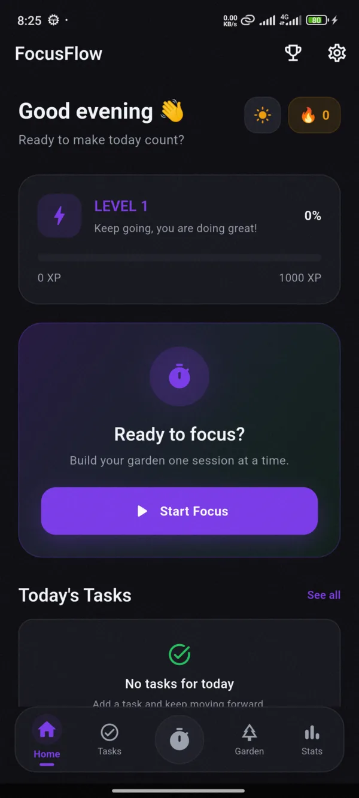
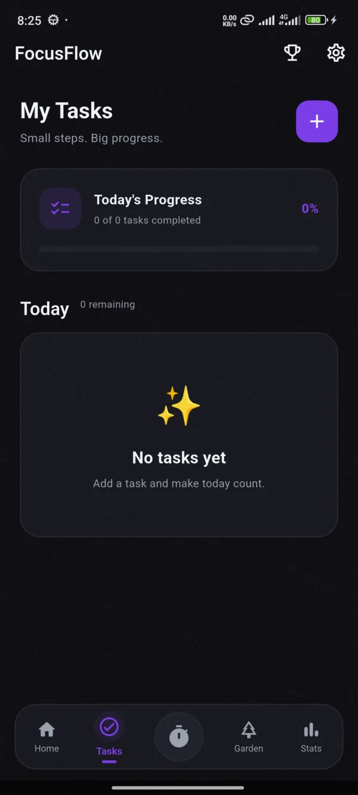
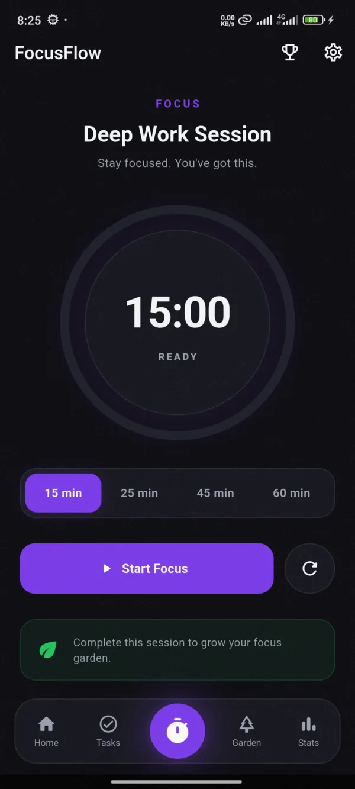
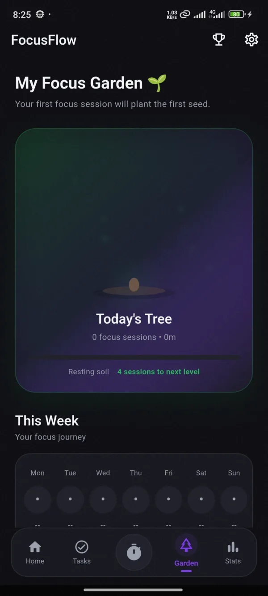
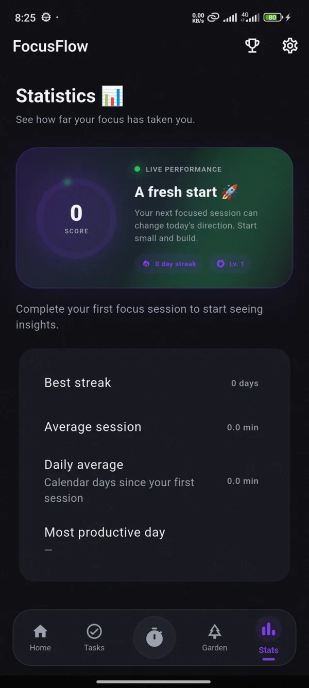

# FocusFlow

<p align="center">
  
</p>

<h3 align="center">Make room for focus.</h3>

<p align="center">
  A privacy-first, local-first productivity app built with Flutter for meaningful tasks,
  deep-focus sessions, progress tracking, achievements, and a growing focus garden.
</p>

<p align="center">
  <a href="https://focusflow-cf64f.web.app"><strong>Website</strong></a>
  ·
  <a href="https://github.com/ibrahem137/focusflow/releases/tag/v1.0.0"><strong>Latest Release</strong></a>
  ·
  <a href="https://focusflow-cf64f.web.app/privacy/"><strong>Privacy</strong></a>
  ·
  <a href="https://focusflow-cf64f.web.app/support/"><strong>Support</strong></a>
</p>

<p align="center">
  <a href="https://github.com/ibrahem137/focusflow/releases/download/v1.0.0/FocusFlow-v1.0.0.apk">
    <strong>Download FocusFlow v1.0.0 for Android</strong>
  </a>
</p>

---

## About

FocusFlow is an open-source productivity application designed to help you organize meaningful work, stay focused, and visualize your progress.

The app follows a **local-first** approach: your productivity data stays on your device. FocusFlow does not require an account, backend server, or cloud storage for its core functionality.

## Screenshots

<table>
  <tr>
    <td align="center"><strong>Home</strong></td>
    <td align="center"><strong>Tasks</strong></td>
    <td align="center"><strong>Focus</strong></td>
    <td align="center"><strong>Garden</strong></td>
    <td align="center"><strong>Statistics</strong></td>
  </tr>
  <tr>
    <td></td>
    <td></td>
    <td></td>
    <td></td>
    <td></td>
  </tr>
</table>

## Features

- Task management and completion tracking
- Focus timer with 15, 25, 45, and 60-minute sessions
- Persistent focus sessions resilient to app backgrounding and restarts
- XP and level progression
- Focus garden that grows through completed sessions
- Productivity statistics and charts
- Achievements and rewards
- Local reminders and notifications
- Light and dark themes
- Onboarding experience
- In-app feedback and support
- Local-first data storage
- Privacy-focused Android configuration

## Focus & Rewards

Completed focus sessions award **2 XP per minute**.

Tasks become eligible for **Claim XP** after completion. Reward claims are persisted so the same reward cannot be claimed repeatedly.

Only successfully completed focus sessions contribute to the focus garden.

The focus timer stores its end timestamp, allowing an active session to remain accurate when the app is backgrounded or restarted.

## Privacy

FocusFlow is designed around a local-first privacy model.

The release build does not require general Internet access for its core productivity functionality. User productivity data remains on the device, and Android application backup is disabled.

The Android release is configured without permissions for:

- Camera
- Microphone
- Location
- Contacts
- Advertising ID
- Media or general storage access
- Exact alarms

The app uses notification and boot-completion permissions to support local reminders.

Read the full [Privacy Policy](https://focusflow-cf64f.web.app/privacy/).

## Tech Stack

- **Flutter**
- **Dart**
- **flutter_bloc** — state management
- **shared_preferences** — local persistence
- **fl_chart** — statistics and charts
- **url_launcher** — external links and support actions
- **package_info_plus** — application version information

The `v1.0.0` release was validated with:

- Flutter 3.47.2
- Dart 3.13.2

## Architecture

FocusFlow uses a feature-oriented Flutter structure with BLoC/Cubit-based state management.

```text
lib/
|-- core/
`-- features/
    |-- achievements/
    |-- focus/
    |-- garden/
    |-- home/
    |-- onboarding/
    |-- progress/
    |-- settings/
    |-- splash/
    |-- stats/
    `-- tasks/
```

For additional details, see [Architecture](docs/ARCHITECTURE.md).

## Getting Started

### Requirements

Install Flutter and verify your development environment:

```bash
flutter doctor
```

Clone the repository:

```bash
git clone https://github.com/ibrahem137/focusflow.git
cd focusflow
```

Install dependencies:

```bash
flutter pub get
```

Run FocusFlow:

```bash
flutter run
```

Machine-specific SDK paths, signing credentials, generated build output, and local Flutter configuration files are intentionally excluded from the repository.

## Android Release

The latest stable Android release is available through GitHub Releases.

**Version:** `1.0.0`  
**Build:** `1`

[Download FocusFlow v1.0.0 APK](https://github.com/ibrahem137/focusflow/releases/download/v1.0.0/FocusFlow-v1.0.0.apk)

### APK SHA-256

```text
8cf72b8be1f789a0b1f3aa4258508ef3c1387003a4b2621f33e1d57fbc95513f
```

You can also view the complete [v1.0.0 release](https://github.com/ibrahem137/focusflow/releases/tag/v1.0.0).

## Android Signing

Real Android signing credentials are **not included** in this repository.

A safe template is provided at:

```text
android/key.properties.example
```

Copy it locally to:

```text
android/key.properties
```

Then replace the placeholder values with your own signing configuration.

Never commit your real `key.properties`, keystore, or signing passwords.

## Validation

FocusFlow includes validation scripts for Windows and Unix-like systems.

### Windows

```powershell
powershell -NoProfile -ExecutionPolicy Bypass -File .\tool\validate.ps1
```

### macOS / Linux

```bash
bash tool/validate.sh
```

The validation pipeline runs:

```text
flutter pub get
dart format --output=none --set-exit-if-changed .
flutter analyze
flutter test
flutter build appbundle --release
```

For version `1.0.0+1`, final validation completed with:

- 58 Dart files formatted with no changes required
- 0 Flutter analyzer issues
- 248 passing tests
- Successful Android App Bundle release build

See [Validation](docs/VALIDATION.md) for additional details.

## Building

Build an Android App Bundle:

```bash
flutter build appbundle --release
```

Build an Android APK:

```bash
flutter build apk --release
```

Release signing requires your own local signing configuration.

## Documentation

- [Architecture](docs/ARCHITECTURE.md)
- [Production Review](docs/PRODUCTION_REVIEW.md)
- [Validation](docs/VALIDATION.md)
- [Release Guide](docs/RELEASE.md)
- [Support & Feedback](docs/SUPPORT_FEEDBACK.md)
- [Changelog](CHANGELOG.md)

## Contributing

Contributions, bug reports, and improvement ideas are welcome.

1. Fork the repository.
2. Create a feature branch.
3. Make your changes.
4. Run the validation suite.
5. Submit a pull request.

Please avoid committing generated files, machine-specific configuration, signing credentials, secrets, or private user data.

## Support

For feedback, bug reports, or questions:

**supportfocusflow3@gmail.com**

Visit the [FocusFlow Support page](https://focusflow-cf64f.web.app/support/).

## License

FocusFlow is open-source software licensed under the [MIT License](LICENSE).

Copyright © 2026 Ibrahem Alhuossien.